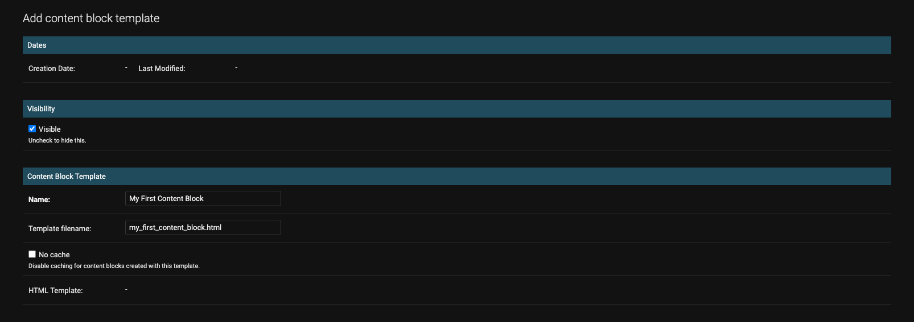
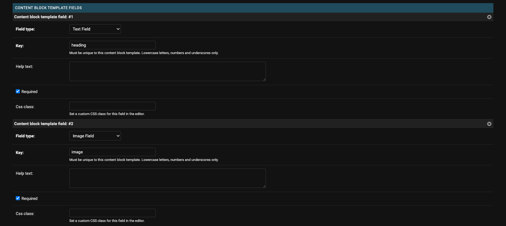
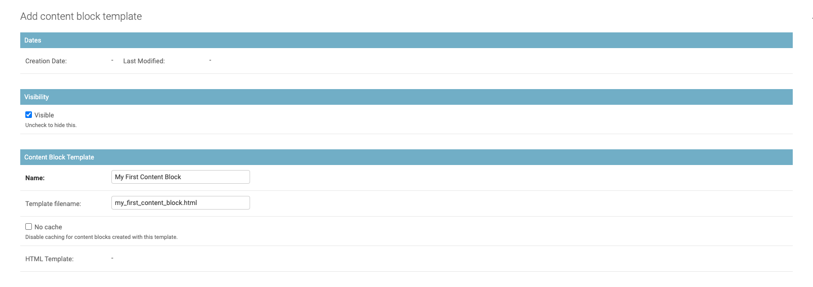
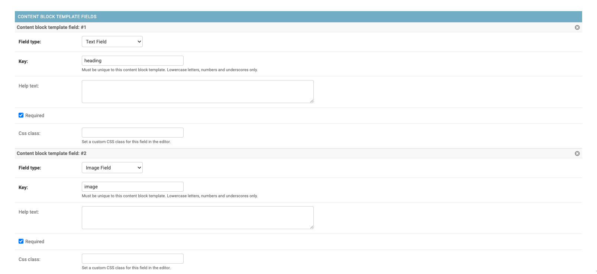

Getting Started
===============

This guide will walk you through the installation process of Django Content Blocks and demonstrate how to create your first content blocks.

Installation
------------

To install Django Content Blocks with pip:

.. code-block:: bash

    $ pip install django-content-blocks

Open ``settings.py`` and add ``content_blocks`` to your ``INSTALLED_APPS``:

.. code-block:: python

    INSTALLED_APPS = (
        # ...
        "content_blocks",
        # ...
    )

Add URL patterns in your project's ``urls.py`` file:

.. code-block:: python

    from django.conf.urls import include

    urlpatterns = [
        # ...
        path("content-blocks/", include("content_blocks.urls")),
        # ...
    ]

Migrate the database:

.. code-block:: bash

    $ python3 manage.py migrate

If `required <https://docs.djangoproject.com/en/4.2/howto/static-files/>`_, collect the static files:

.. code-block:: bash

    $ python3 manage.py collectstatic

Add Content Blocks Functionality to an Existing Model
-----------------------------------------------------

To add content block functionality to an existing model, you should extend your model from :py:class:`ContentBlockParentModel` instead of :py:class:`models.Model`. For example, here the :py:class:`Page` model is extended from :py:class:`ContentBlockParentModel`.

.. code-block:: python
    :caption: models.py

    from django.db import models

    from content_blocks.models import ContentBlockParentModel

    class Page(ContentBlockParentModel):
        # ...

This will add a field for the content blocks to your model so you will then need to make migrations and migrate the database:

.. code-block:: shell

    $ python3 manage.py makemigrations
    $ python3 manage.py migrate

To show the content block editor button in the admin site extend :py:class:`ContentBlockModelAdmin` instead of :py:class:`admin.ModelAdmin` and add ``"content_blocks_button"`` to your fieldsets.

.. code-block:: python
    :caption: admin.py

    from django.contrib import admin

    from content_blocks.admin import ContentBlockModelAdmin

    from .models import Page

    @admin.register(Page)
    class PageAdmin(ContentBlockModelAdmin):
        fieldsets = (
            (
                "Page",
                {"fields": [
                    # ...
                    "content_blocks_button"
                    # ...
                    ]
                },
            ),
        )

For further information and an example app, to use if you don't have your own, please see the :doc:`example_pages_app` documentation.

Create Your First Content Block Template
----------------------------------------

To create a content block template, you need two parts: a :py:class:`ContentBlockTemplate` object created in the admin site and an HTML template.

Let's create a simple :py:class:`ContentBlockTemplate` object with a :py:class:`TextField` and an :py:class:`ImageField`.

You can see we have set the ``template_filename`` to ``my_first_content_block.html``.  Create this file in your projects template directory under ``content_blocks/content_blocks/my_first_content_block.html``.

.. code-block:: django
    :caption: content_blocks/content_blocks/my_first_content_block.html

    

        <h1>{{ content_block.heading }}</h1>
        
    

Every content block template is passed the ``content_block`` context variable. This contains all the context for the content block available by the ``key`` you chose when creating the :py:class:`ContentBlockTemplateField` objects in the admin site. In addition to the context you defined ``css_class`` is added to every content block.

For further information on content block templates and the available fields please see the :doc:`content_block_templates` documentation.

Create Your First Content Block
-------------------------------

To start adding content blocks, you can use the content block editor. If you're using the :doc:`example pages app <example_pages_app>`, create a new :py:class:`Page` object in the admin site and click the `Save and edit content blocks` button. If you're using another model, go to the change page of an existing object or make a new one.

In the add new content block form, select the content block template you created. Then click the `Add My First Content Block` button, and a form will appear where you can add the heading and image. After you've entered the content, click the `Publish` button.

For more information about the content block editor, please see the :doc:`the_content_block_editor` documentation.

Rendering Content Blocks
------------------------

To render a content block on a page, you need to add the following code to the template of the detail view for your object:

.. code-block:: django

    

    
        
    

In this code, ``object`` refers to the object that the content blocks belong to, and ``content_blocks`` is the related manager for the :py:class:`ContentBlock` model. The :py:meth:`visible` method is called on this manager to retrieve only the content blocks that are marked as visible.

The ```` template tag returns the HTML code for the content block based on its associated template and context as well as the current context.

After adding this code, you should be able to view your content block on your site by visiting the detail view for your object.

.. note::
    You will need to provide CSS and JavaScript to style your content blocks and bring them to life.

For more information and examples of rendering content blocks, see the :doc:`example_pages_app` documentation.

Content Block Collections
-------------------------

A :py:class:`ContentBlockCollection` is a simple model that extends :py:class:`ContentBlocksParentModel` in the same way you add content blocks to existing models.  However :py:class:`ContentBlockCollection` objects don't have a detail view.  Instead you can render them in any template with a template tag.

For example if you create a :py:class:`ContentBlockCollection` with a slug of ``header``:

.. code-block:: django

    

    

Using :py:class:`ContentBlockCollection` objects is a good way to manage repeating sections of your website, such as the header and footer.

Next Steps
----------

Great job! You've completed the tutorial on Django Content Blocks. Now that you have a good understanding of the basics, you can continue to experiment with creating more content block templates and using the content block editor to add content to your website.

To further customize the behavior of Django Content Blocks, you can read the :doc:`configuration` documentation to learn about the various settings available.

Additionally, you can explore the :doc:`content_block_templates` and :doc:`the_content_block_editor` documentation to learn about all of the features available in Django Content Blocks.
