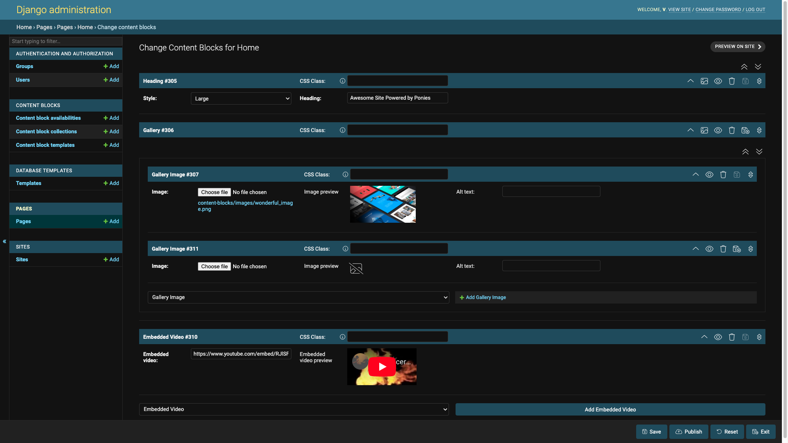
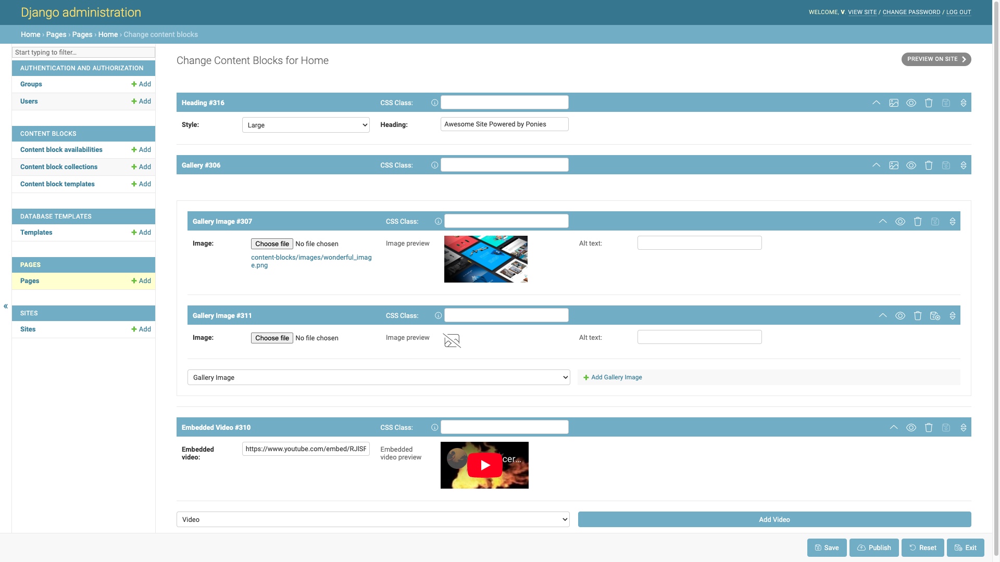

Django Content Blocks Documentation
===================================

Introduction
------------

Django Content Blocks lets you build websites using content blocks, which are pieces of HTML created from predefined templates but rendered with their own context. Content block templates are created in the Django admin site by choosing which fields to make available and then providing an HTML template file to render the content block.

Content blocks are created using the content block editor, also within the Django admin site. This editor allows for the addition of images, videos, and text content. Additionally, the :py:class:`NestedField` and :py:class:`ModelChoiceField` provide the power to create a huge range of content blocks which can be integrated with the rest of your project.

For an example of what can be achieved with Django Content Blocks, please see https://shystudios.co.uk, where all pages except the project list view are made using content blocks.

Intended Use
------------

Django Content Blocks works great with anything that has a detail view to which you want to add rich editable HTML content, such as products, projects, team members, and pages.

It is not a full-featured CMS but does allow adding content to detail views and can handle repeating page elements such as the header and footer. The Django admin site is used for both editing content blocks and content block templates, which is good if you're already using and like the Django admin site.

These docs explain how to create an :doc:`example_pages_app` to display web pages made with content blocks. This means it's possible to make entire websites with Django Content Blocks and a simple app like this.

Other Packages to Consider
--------------------------

If Django Content Blocks does not meet your requirements, you may consider using one of the following packages:

* https://wagtail.org/
* https://www.django-cms.org/
* https://pypi.org/project/django-streamfield/
* https://docs.djangoproject.com/en/4.2/ref/contrib/flatpages/

Table of Contents
-----------------

.. toctree::
   :maxdepth: 2
   :caption: Contents:

   Introduction <self>
   getting_started
   configuration
   content_block_templates
   the_content_block_editor
   example_pages_app
