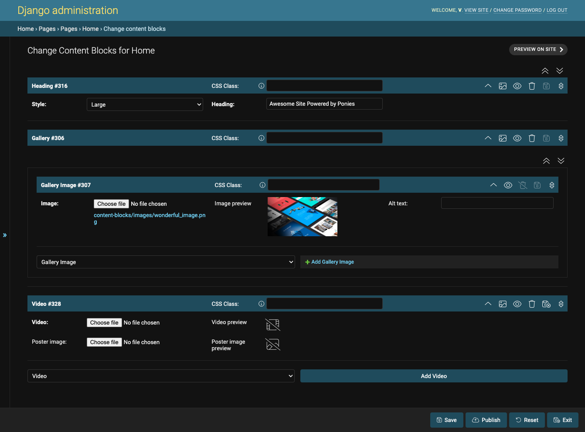
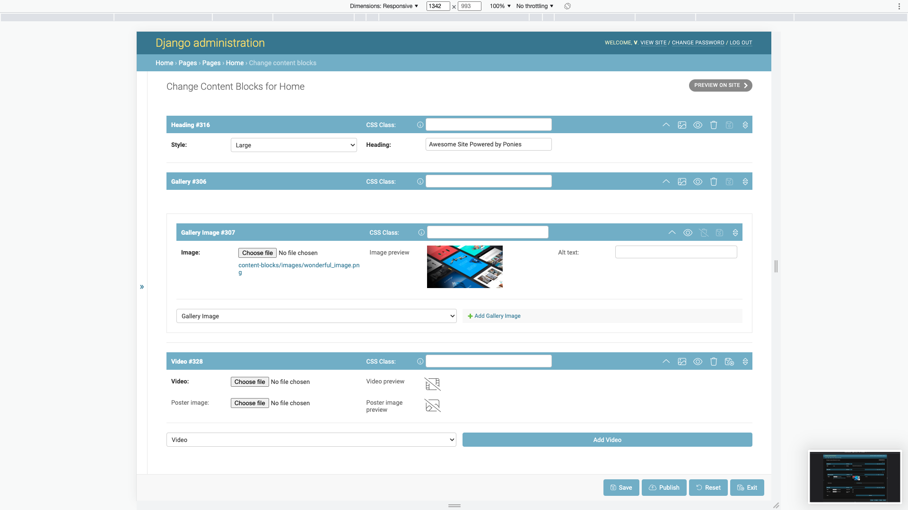

The Content Block Editor
========================

Interface
---------

Preview on Site
^^^^^^^^^^^^^^^

.. todo:: Insert preview image here.

This button will open a preview of the page in a new tab. It will only be available if you have configured page previews (see :ref:`PagePreviews`).

Wrapper Controls
^^^^^^^^^^^^^^^^

.. todo:: Insert wrapper controls image here.

Use the collapse/expand all content blocks button to easily reorder your content blocks.

Content Block Controls
^^^^^^^^^^^^^^^^^^^^^^

.. todo:: Insert content block controls image here.

* Expand/collapse: Use this button to expand or collapse a content block.
* :ref:`Show preview <ContentBlockPreview>`: This button will show a preview of the content block.
* Toggle visibility on website: Use this button to toggle the visibility of the content block on the website.
* Delete: Use this button to delete the content block.
* Save: Use this button to save the content block.
* Drag to reorder: Drag and drop the content blocks to reorder them.

Add Nested Content Block
^^^^^^^^^^^^^^^^^^^^^^^^

Choose the :py:class:`ContentBlockTemplate` and add a new content block to the :py:class:`NestedField`.

Add Content Block
^^^^^^^^^^^^^^^^^

Choose the :py:class:`ContentBlockTemplate` and add a new content block to the page.

Publish Bar
^^^^^^^^^^^

* Save all content blocks: Use this button to save all content blocks.
* Publish content blocks: Use this button to publish all content blocks.
* Reset content blocks to published state: Use this button to reset all content blocks to their published state.
* Save and exit: Use this button to save and exit the content block editor.

For more information on drafts, publishing, and previews, see :ref:`DraftsPublishingPreviews`.

Importing Content Blocks From Another Object
--------------------------------------------

.. todo:: Insert screenshot of empty content block editor here.

If you have created content blocks for another object, you can easily import them when adding new objects of the same type. Before adding any content blocks, choose the object you want to import from and press the `Import Content Blocks` button. The draft content blocks from the chosen object are cloned and added to the new object ready for you to edit the content.

This feature allows you to quickly create pages with the same layout of content blocks.

Drafts, Publishing, and Previews
---------------------------------

All content blocks are saved as drafts. These drafts are used for previews. Only after you have published the content blocks, with the `Publish` button, will the updates show on your website.

You can reset all content blocks to their published state with the `Reset` button.
